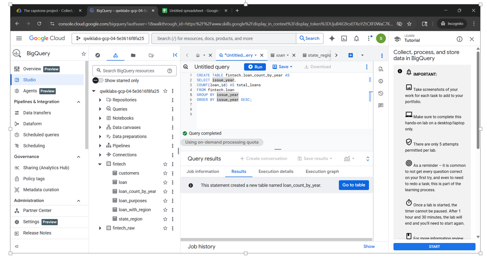

# data-journey
# Seethepalli Chaya - Data Analyst Portfolio
**7 Years QA Experience | Google Cloud Certified**

## 🚀 Featured Project: Fintech Loan Data Lifecycle (GCP)
This project covers the end-to-end data journey: Collect, Process, Store, Analyze, and Activate.

### 1. Data Processing & Storage (BigQuery)
I used BigQuery to transform raw loan data into a structured reporting format.
* **Key Skills:** SQL Joins, Deduplication, Data Cleaning.
* 
* 
* 

### 2. Data Visualization (Looker Enterprise)
I architected an interactive dashboard to track loan performance.
* **Key Features:** Cross-filtering, Top 10 State Analysis, Customer Segmentation.
* 

## 🛠 Technical Toolbox
* **Data:** SQL (BigQuery), Python (Basic), Looker Enterprise.
* **QA:** Manual Testing, Root Cause Analysis, Jira.

